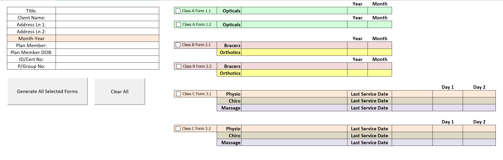

# MediFormGen: a VBA-Powered Rehabiliation Clinic Management Software 

### Featuring Word Document Autocompletion and Database Integration

## Overview

This project is a Microsoft Word-based solution designed to automate the generation of invoices and other related documents for a physiotherapy practice. It leverages VBA (Visual Basic for Applications) scripting to provide autocompletion capabilities, pulling data from pre-defined templates and populating them with client-specific information. The generated documents are then saved as editable Word files, and relevant data is simultaneously logged into a local database.

## Key Features

*   **Template-Based Autocompletion:**  The system uses a set of 12 predefined templates (categorized as Logic Types A, B, and C) to generate invoices and other documents. These templates are pre-populated with relevant fields, and the VBA script fills in the dynamic data based on the selected client and service.
*   **Dynamic Invoice/Order Number Generation:** The application automatically generates invoice and order numbers based on a complex, configurable logic:
    *   Numbers increment sequentially, starting from a user-defined base number.
    *   Numbers are allocated based on business days of the week, with specific days reserved for certain document types.
    *   A configurable number of slots (default 20) are reserved for each business day. When these slots are filled, the system loops back to the first available slot on the first business day of the relevant period.
    *   This logic ensures unique invoice/order numbers and accounts for the clinic's scheduling patterns.
*   **Logic Types:**
    *   **Type A:** Generates invoices based on a configurable set of business days (e.g., Monday, Wednesday, Friday).
    *   **Type B:** Similar to Type A but with a different set of business days (e.g., Tuesday, Thursday).
    *   **Type C:**  Generates invoices based on a selection of two months and two or three days of the week. The billing date is determined by counting 15 service days based on the selected days within the selected months.
*   **Database Integration:**  Extracted data from the generated documents is stored in a local database.
    *   **DB1:** Stores service/product descriptions and prices.
    *   **DB2:** (Optional) Stores doctor information (e.g., name, specialization, registration number).
*   **User-Configurable Settings:**
    *   Starting invoice/order number.
    *   Business days for each document type (Logic Type A, B, and C).
    *   Months for Type C logic.
    *   Initials used in invoice number formatting (e.g., "PM" in "141-P14PM").
*   **File Naming and Organization:**  Generated documents are saved in folders named according to the format: "\[Client Name] - \[Client Address]". File names follow a similar structure, based on the client name, invoice number, and other relevant information.
*   **Error Handling:**  The system includes basic error handling, such as displaying an error message if the invoice/order number allocation logic encounters an unexpected scenario (e.g., running out of numbers, although this is unlikely).
*   **Document Regeneration:** In the event of accidental deletion or loss of generated documents, the system can recreate them. By using the data stored in the local database (client information, service details, invoice numbers, etc.) and the original document templates, the VBA script can repopulate the templates and generate new Word files that are identical to the lost originals.
*   **Canadian Calendar Handling with Holiday and Leap Year Support:**
    *   **Leap Year Adjustment:** The VBA code accurately calculates leap years to ensure correct date calculations across different years.
    *   **Holiday Integration:** The system incorporates a comprehensive list of Canadian federal and provincial holidays.
        *   **Federal Holidays:**  New Year's Day, Good Friday, Easter Monday (optional), Victoria Day, Canada Day, Labour Day, Thanksgiving Day, Remembrance Day (optional), Christmas Day, Boxing Day.
        *   **Provincial/Territorial Holidays:** The code considers region-specific holidays.
    *   **Holiday Impact on Invoice/Order Numbers:** The logic for generating invoice/order numbers dynamically adjusts to skip holidays. If a configured business day falls on a holiday, the system automatically allocates the number to the next available business day, maintaining the sequence and preventing gaps or duplicates.
    * **Configurable Province:** User can specify the province for which the invoices are generated. This selection determines which set of provincial holidays are considered during the invoice/order number allocation and date calculations.

## Showcase

_A fully interactive and feature-complete user interface built in accordance with specific user wishes - ascetic functional simplicity._

_Nulled functional local database with built-in backup and recovery methods. Proved to be robust and reliable_

## Technologies Used

*   Microsoft Word
*   VBA (Visual Basic for Applications)
*   Local Database - for privacy protection reasons the database has been nulled for the public GitHub release.
*   Local password - for privacy protection reasons the password has been nulled for the public GitHub release.
*   Local PHI      - for privacy protection reasons any and all PHI has been nulled for the public GitHub release, inclduing the publicly availble clinic names to ensure absolute privacy.
